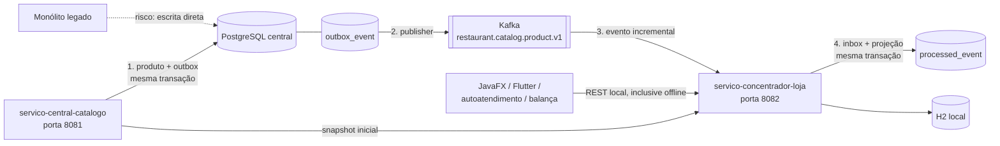

# Kafka Restaurant Sync Lab

> Comece pelo [guia de estudo](docs/GUIA_DE_ESTUDO.md), que explica o fluxo e a ordem de leitura.

Neste laboratório, os nomes visíveis de negócio usam português: serviço central de catálogo, serviço concentrador da loja, salvar produto, atualizar produto, listar produtos e carga inicial.

Laboratório executável para estudar a migração de um monólito de restaurantes para microsserviços, com carga inicial e atualização incremental de uma loja por Kafka.

O recorte implementado é o catálogo de produtos, mas o padrão se repete para preço, promoção, estoque, cardápio, balança e configuração de dispositivos. O JavaFX, o Flutter, o autoatendimento e a autopesagem **não acessam o Kafka**: eles consultam a API REST local do sincronizador.

## O que o projeto demonstra

- gravação do dado central e do evento na mesma transação com **transactional outbox**;
- publicação assíncrona do outbox, com produtor Kafka idempotente;
- consumidor local com semântica **at-least-once**;
- idempotência por `eventId` (inbox) e proteção contra regressão por `sourceVersion`;
- três novas tentativas e envio para `.dlt` quando o evento não pode ser processado;
- carga inicial via API e atualização incremental via Kafka sem uma carga antiga sobrescrever um evento novo;
- banco H2 persistente na máquina da loja, mantendo a API disponível sem internet;
- configuração externa para cada loja, ambiente, tópico e cluster.

## Arquitetura do laboratório



## Módulos

| Módulo | Responsabilidade |
|---|---|
| `contratos-eventos` | Contrato JSON didático do evento e da carga inicial |
| `servico-central-catalogo` | API central, PostgreSQL, Flyway, outbox e produtor Kafka |
| `servico-concentrador-loja` | Consumidor Kafka, retry/DLT, inbox idempotente, H2 e API local |
| `compose.yaml` | Kafka em KRaft e PostgreSQL para desenvolvimento |

Em produção, evite distribuir um JAR compartilhado para todas as 15 APIs. Publique contratos independentes em Schema Registry (Avro, Protobuf ou JSON Schema) e aplique regras de compatibilidade. O JAR compartilhado aqui deixa o estudo mais curto.

## Pré-requisitos

- Java 21;
- Maven 3.6.3 ou superior;
- Docker com Compose.

## Como executar

Na raiz do projeto:

```powershell
docker compose up -d
mvn clean package
```

Abra dois terminais:

```powershell
java -jar .\servico-central-catalogo\target\servico-central-catalogo-1.0.0-SNAPSHOT.jar
```

```powershell
java -jar .\servico-concentrador-loja\target\servico-concentrador-loja-1.0.0-SNAPSHOT.jar
```

Identidade padrão da loja:

```text
tenantId = 11111111-1111-1111-1111-111111111111
storeId  = 22222222-2222-2222-2222-222222222222
```

Crie um produto na API central:

```powershell
$body = @{
  tenantId = "11111111-1111-1111-1111-111111111111"
  storeId  = "22222222-2222-2222-2222-222222222222"
  sku      = "X-BURGER"
  name     = "X-Burger"
  price    = 24.90
  active   = $true
} | ConvertTo-Json

$product = Invoke-RestMethod `
  -Method Post `
  -Uri "http://localhost:8081/api/catalogo/produtos" `
  -ContentType "application/json" `
  -Body $body
```

Consulte a API local que seria usada pelo PDV:

```powershell
Invoke-RestMethod "http://localhost:8082/api/local/produtos?activeOnly=false"
```

Execute uma carga inicial/reconciliação:

```powershell
Invoke-RestMethod `
  -Method Post `
  -Uri "http://localhost:8082/interno/sincronizacao/carga-inicial"
```

Consulte os estados operacionais:

```powershell
Invoke-RestMethod "http://localhost:8081/internal/outbox/status"
Invoke-RestMethod "http://localhost:8082/interno/sincronizacao/status"
```

O script `scripts/demo.ps1` cria e altera um produto automaticamente, desde que a infraestrutura e as duas aplicações estejam em execução.

## Experimento de indisponibilidade

1. Pare somente o Kafka com `docker compose stop kafka`.
2. Altere um produto pela API central. A alteração deve funcionar e `pendingEvents` deve aumentar.
3. Consulte `http://localhost:8082/api/local/products`: a API local continua funcionando com o último estado conhecido.
4. Inicie o broker com `docker compose start kafka`.
5. O publisher esvazia o outbox e a loja recebe a nova versão.

Esse experimento mostra duas propriedades diferentes: **disponibilidade offline da leitura local** e **entrega eventual da atualização**.

## Onde estudar primeiro

1. `servico-central-catalogo/.../ProductService.java`: transação que grava produto + outbox.
2. `servico-central-catalogo/.../OutboxPublisher.java`: entrega para o Kafka e tolerância à indisponibilidade.
3. `servico-concentrador-loja/.../KafkaConsumerConfiguration.java`: retry e DLT.
4. `servico-concentrador-loja/.../ProductEventProcessor.java`: filtro de loja, inbox e versão.
5. `servico-concentrador-loja/.../SnapshotImportService.java`: convivência entre carga inicial e tempo real.
6. Os dois `application.yml`: propriedades que variam por ambiente/loja.

Veja também:

- [Mapa exato de alterações](docs/CHANGE_MAP.md)
- [Revisão arquitetural do cenário](docs/ARCHITECTURE_REVIEW.md)
- [Contrato e catálogo de eventos](docs/EVENT_CONTRACT.md)
- [Runbook operacional](docs/OPERATIONS_RUNBOOK.md)

## Decisões intencionais

- O tópico representa um fluxo de negócio (`catalog.product`), não um endpoint REST.
- A chave é `storeId:productId`, preservando ordem por produto e permitindo paralelismo.
- O consumidor confirma o offset somente após a transação local.
- Uma duplicidade entre gravação no Kafka e marcação do outbox é esperada; o inbox absorve isso.
- A DLT é quarentena, não descarte. Reprocessamento exige corrigir a causa e manter o mesmo `eventId`.
- O exemplo usa um broker e fator de replicação 1 apenas localmente. Produção deve usar múltiplos brokers, TLS/SASL e fator de replicação compatível.

## Referências oficiais

- [Spring for Apache Kafka](https://spring.io/projects/spring-kafka/)
- [Spring Kafka: transações](https://docs.spring.io/spring-kafka/reference/kafka/transactions.html)
- [Spring Kafka: exactly-once](https://docs.spring.io/spring-kafka/reference/kafka/exactly-once.html)
- [Apache Kafka Quickstart](https://kafka.apache.org/quickstart/)
