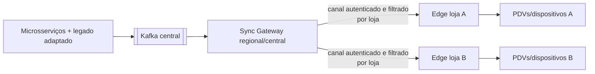

# Revisão arquitetural do cenário

## Parecer executivo

Kafka é uma boa peça para a atualização incremental, mas não resolve sozinho os maiores riscos deste projeto. O ponto mais delicado é a combinação de quatro transições ao mesmo tempo:

1. monólito e microsserviços escrevendo no mesmo banco;
2. clientes apontando para dois backends;
3. carga inicial ainda incompleta;
4. operação offline em máquinas de clientes.

O sistema precisa definir claramente **quem é dono de cada dado**, **qual caminho aceita comandos** e **como toda alteração vira evento**. Sem isso, Kafka apenas distribui inconsistências mais rápido.

## Riscos priorizados

| Prioridade | Risco | Consequência | Controle recomendado |
|---|---|---|---|
| P0 | Monólito/ERP alteram tabela sem gerar evento | loja fica com preço/cardápio antigo | outbox em todos os escritores ou CDC controlado |
| P0 | PDV envia a mesma venda ao mono e ao MS | venda/pagamento/fiscal duplicado | rota autoritativa por capacidade + idempotency key |
| P0 | Cada loja conecta no tópico multi-tenant e filtra localmente | exposição de dados e enorme fan-out | sync gateway autorizado ou estratégia segura de segmentação |
| P0 | Snapshot e Kafka sem marca de corte/versão | perda ou regressão de atualização | versão monotônica + watermark + reconciliação |
| P0 | Pedido offline sem outbox/ack | venda some ou é duplicada ao reconectar | UUID do cliente + outbox local + inbox central + confirmação |
| P1 | Um banco e tabelas compartilhadas por 15 APIs | acoplamento, deploy coordenado, locks | dono por tabela/schema e credenciais de escrita exclusivas |
| P1 | Retenção menor que tempo offline | loja não recupera o período ausente | retenção pelo SLA + resnapshot automático |
| P1 | Contrato JSON sem governança | quebra simultânea de centenas de lojas | Schema Registry, compatibilidade e rollout consumer-first |
| P1 | DLT sem processo operacional | inconsistência permanente escondida | alerta, ownership, correção e replay auditado |
| P1 | Broker exposto a clientes | ataque, vazamento, operação frágil em WAN | TLS/SASL, ACL, VPN; preferencialmente gateway |
| P2 | Quase 15 tópicos/consumidores copiados | configuração divergente | starter interno de infraestrutura e golden path |

## A principal decisão: Kafka chega até a loja?

O laboratório conecta o sincronizador diretamente ao Kafka para tornar o mecanismo visível. Isso não significa que seja a melhor topologia de produção.

Se cada loja usar um `group.id` próprio num tópico compartilhado, **cada grupo lê o fluxo inteiro**. O filtro por `storeId` ocorre tarde demais: os bytes e potencialmente dados de outros tenants já chegaram ao cliente. ACL de Kafka normalmente protege tópico, não linhas individuais.

Antes de aprovar essa topologia, levante:

- número atual e projetado de lojas;
- eventos por segundo e tamanho médio;
- percentual de eventos útil para cada loja;
- tempo máximo offline;
- conectividade e IPs variáveis;
- requisito legal de isolamento por cliente;
- quantidade de grupos e conexões que o cluster suportará.

Para muitas lojas, a topologia preferível é:

O gateway pode oferecer stream autenticado por WebSocket/gRPC, long polling com cursor, ou API de deltas. Kafka continua sendo o backbone interno, enquanto a borda recebe somente seus dados. Para poucos clientes corporativos em VPN e tópicos isolados, conexão direta pode ser aceitável, desde que medida e protegida.

Evite um tópico por loja sem análise: milhares de lojas multiplicadas por quinze domínios podem causar explosão de tópicos e partições. Segmentação por tenant, região ou bucket é uma alternativa, mas precisa de cálculo de capacidade.

## Banco central único durante a transição

Um único servidor de banco não impede uma migração incremental, mas “todos podem escrever em tudo” impede autonomia real.

Passo intermediário recomendado:

- um schema lógico por domínio;
- uma credencial por serviço;
- somente o dono tem permissão de escrita;
- consultas entre domínios passam por API/evento ou, temporariamente, views de leitura;
- migrations pertencem ao serviço dono;
- toda exceção de escrita cruzada tem prazo de remoção.

Isso permite manter dados fisicamente centralizados agora e separar bancos depois, sem fingir que os serviços já são independentes.

## Como capturar alterações do monólito

Opções, em ordem de preferência:

1. **Outbox no monólito:** a mesma transação que altera o negócio insere o evento. Melhor semântica.
2. **Outbox por procedure/trigger controlado:** útil quando é difícil alterar todos os caminhos, mas aumenta lógica no banco.
3. **Debezium/CDC:** captura mudanças mesmo de escritores esquecidos; ótimo para transporte, porém uma mudança de linha não é necessariamente um evento de negócio.
4. **Polling por `updated_at`:** solução temporária; exige versão, paginação, exclusões e tratamento de empate.

CDC direto das tabelas compartilhadas tende a vazar detalhes de schema e gerar eventos pouco semânticos. Uma combinação comum é o monólito escrever uma tabela outbox e o Debezium publicar essa tabela.

## Matriz de autoridade para o corte

Crie uma tabela real por capacidade, não apenas “75% migrado”:

| Capacidade | Leitura oficial | Escrita oficial | Publica evento | Mono ainda escreve? | Critério de desligamento |
|---|---|---|---|---|---|
| Produto | MS | MS | catálogo | sim/não | zero escrita mono por 30 dias |
| Preço | MS | MS/ERP | pricing | sim/não | reconciliação sem diferença |
| Pedido | MS ou mono | exatamente um | sales | sim/não | idempotência e fiscal aprovados |
| Pagamento | definido por adquirente | exatamente um | payment | sim/não | nenhum double capture |

PDV JavaFX e Flutter podem falar com duas plataformas durante a migração, mas uma **mesma capacidade** deve ter um único destino autoritativo por loja. Use feature flag/cutover registry central, não tentativa aleatória ou fallback de escrita entre mono e MS.

Fallback automático é aceitável para leitura com versão conhecida. Para comandos financeiros, tentar MS e depois mono após timeout pode duplicar uma operação que já foi concluída.

## Offline: separar dados de referência de transações

Dados central → loja, como produtos e preços:

- central é autoridade;
- edge mantém projeção;
- versão central resolve ordem;
- desativação é explícita;
- snapshot periódico reconcilia desvios.

Dados loja → central, como venda e fechamento:

- edge é autoridade temporária enquanto offline;
- o cliente gera UUID antes da primeira tentativa;
- grava comando e outbox local na mesma transação;
- reenvia até receber confirmação de negócio;
- central mantém inbox por UUID;
- `Kafka ack` significa persistência no broker, não que a venda foi aceita;
- status local diferencia `PENDING`, `DISPATCHED`, `ACCEPTED` e `REJECTED`.

Conflitos precisam de regra de negócio. Exemplo: o preço usado numa venda deve ser armazenado como snapshot no item do pedido. Atualizar o cadastro depois não altera uma venda já realizada.

## Pontos específicos de restaurante/PDV

- **Preço e promoção:** registre versão da regra e valor aplicado em cada item.
- **Estoque:** movimento é mais seguro que sobrescrever saldo; reservas offline exigem política de reconciliação.
- **Fiscal:** defina contingência por UF/modelo fiscal e nunca dependa apenas de consistência eventual.
- **Pagamento:** não publique PAN/CVV; diferencie autorização, captura, cancelamento e conciliação.
- **Caixa:** use `businessDate` e turno; não confie apenas no relógio local.
- **Balança/PLU:** valide limites, casas decimais, tara e compatibilidade do equipamento antes do rollout.
- **Autoatendimento:** preserve um último cardápio válido e sinalize recursos indisponíveis.
- **Receitas/combos/adicionais:** atualize agregados coerentes; um produto novo sem seus complementos pode tornar o menu inválido.
- **LGPD:** minimize dados de clientes na borda, criptografe o disco e estabeleça expiração.

## Carga inicial robusta

O fluxo de produção recomendado é:

1. registrar instalação, identidade e versão do edge;
2. obter token/certificado exclusivo;
3. capturar watermark do fluxo incremental;
4. baixar snapshot paginado, comprimido e com checksum;
5. aplicar em staging local;
6. validar contagem e integridade referencial;
7. trocar staging por versão ativa;
8. reproduzir eventos após o watermark;
9. persistir progresso por domínio;
10. declarar loja `READY` somente quando domínios obrigatórios estiverem consistentes.

Uma carga “80% pronta” deve ter critérios objetivos: quais domínios faltam, volume máximo testado, tempo total, retomada após queda, exclusões, checksum, observabilidade e rollback.

## Observabilidade mínima

Painel central:

- idade e quantidade do outbox pendente por serviço;
- taxa de publicação e erro;
- lag por grupo/partição;
- eventos na DLT;
- lojas online, atrasadas e fora da retenção;
- versão do edge e último heartbeat;
- duração/resultado da carga inicial;
- divergência encontrada na reconciliação.

Painel/diagnóstico local:

- último evento aplicado por domínio;
- versão/cursor;
- tamanho do outbox local;
- espaço em disco;
- status do banco;
- conectividade central;
- relógio e certificado.

Evite usar apenas `lastProcessedAt`: uma loja sem eventos legítimos parece parada. Combine heartbeat, offsets e watermark central.

## Sequência recomendada de evolução

1. Inventariar todos os escritores das tabelas compartilhadas.
2. Definir matriz de autoridade por capacidade/loja.
3. Padronizar envelope, outbox, inbox, DLT, métricas e segurança.
4. Finalizar carga inicial com watermark e reconciliação.
5. Pilotar um domínio somente leitura, como produtos.
6. Testar loja offline além do tempo normal e reconectar.
7. Implementar fluxo loja → central com pedidos e confirmação.
8. Executar piloto pequeno, comparar bancos e medir lag.
9. Expandir por domínio e grupos de lojas com feature flags.
10. Retirar a escrita legada e depois a leitura legada de cada capacidade.

Registre as decisões em ADRs: topologia de borda, estratégia de captura do legado, chave de partição, retenção, schema, conflito offline, segurança e critérios de cutover.

