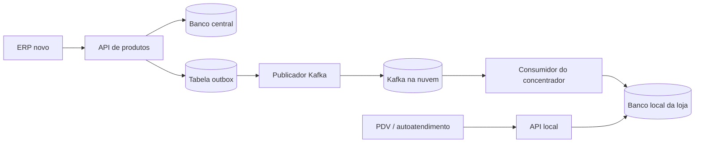
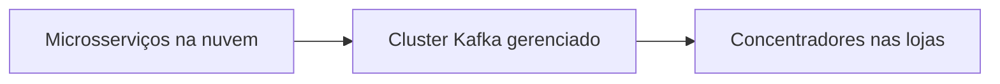
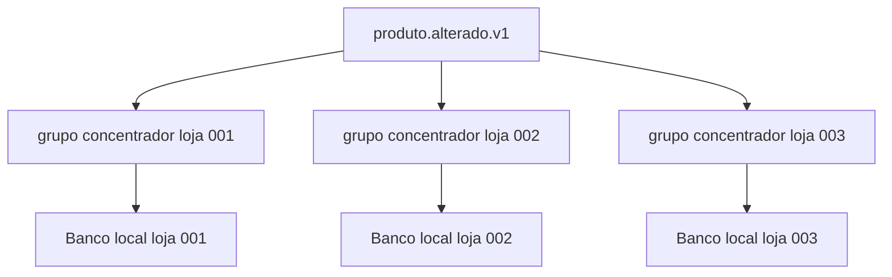
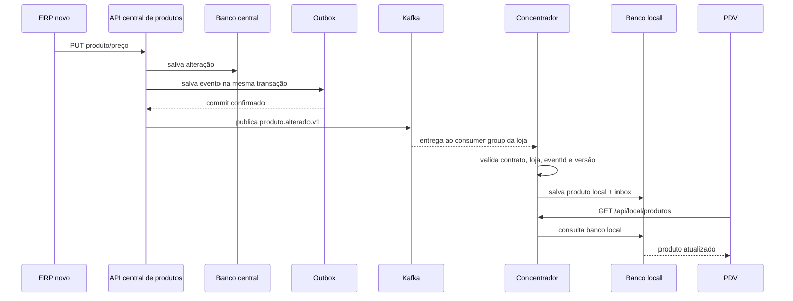
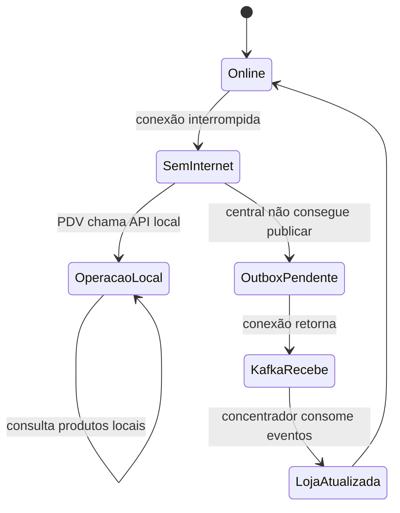
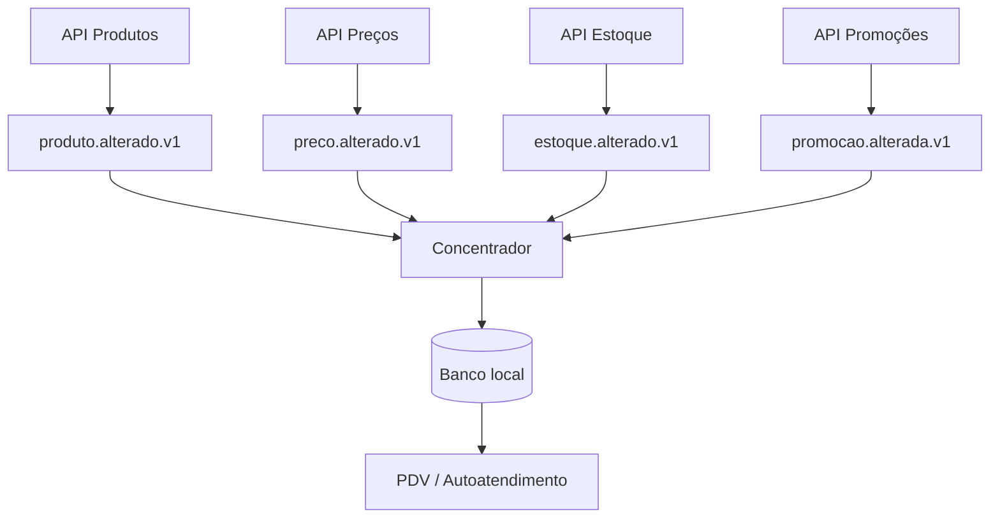

# Kafka no cenário do cliente — explicação visual

Este guia responde à pergunta: **onde o Kafka entra em cada parte do sistema?**

## 1. A visão mais simples

Kafka não fica dentro do controller e não substitui o banco. Ele é um serviço de infraestrutura separado, usado para transportar mudanças entre aplicações.



O fluxo é:

```text
ERP altera produto
    ↓
API central salva produto
    ↓
API registra evento na tabela outbox
    ↓
publicador envia evento para Kafka
    ↓
concentrador consome evento
    ↓
concentrador atualiza banco local
    ↓
PDV consulta API local
```

## 2. Onde Kafka fica fisicamente

Kafka é executado como uma infraestrutura separada. Ele pode ficar:

### Opção A — Kafka gerenciado na nuvem

```text
AWS MSK
Azure Event Hubs compatível com Kafka
Confluent Cloud
Google Cloud Managed Kafka
```



Essa é a opção mais comum quando várias lojas precisam receber atualizações.

### Opção B — Kafka em máquinas virtuais

```text
VM 1: broker Kafka
VM 2: broker Kafka
VM 3: broker Kafka
```

Em produção normalmente são usados três ou mais brokers para alta disponibilidade.

### Opção C — Kafka local para desenvolvimento

No laboratório:

```text
docker compose
    ├── PostgreSQL
    └── Kafka KRaft
```

O arquivo `compose.yaml` cria Kafka local apenas para estudo. Ele não representa necessariamente o desenho final de produção.

## 3. Kafka não deve ficar dentro de cada API

Cada API não instala um Kafka próprio.

O desenho correto é:

```text
20 APIs ───────┐
               ├── Cluster Kafka compartilhado
concentradores ┘
```

Cada API possui apenas um cliente Kafka configurado:

- produtor, quando publica eventos;
- consumidor, quando escuta eventos;
- produtor e consumidor, quando faz os dois papéis.

## 4. Configuração centralizada ou por API?

Existem duas coisas diferentes:

### Infraestrutura Kafka

Deve ser administrada centralmente:

- endereço dos brokers;
- TLS e SASL;
- ACLs/permissões;
- criação de tópicos;
- número de partições;
- fator de replicação;
- retenção;
- monitoramento.

Isso normalmente fica em:

```text
Terraform / Helm / Kubernetes / Confluent Cloud / equipe de infraestrutura
```

### Configuração do cliente Kafka

Fica em cada aplicação, porque cada uma tem uma responsabilidade diferente:

```yaml
spring:
  kafka:
    bootstrap-servers: ${KAFKA_BOOTSTRAP_SERVERS}
```

Uma API de produtos terá seu tópico e configuração de produtor. Uma API de estoque poderá ter outro tópico. O endereço do cluster pode ser o mesmo, mas grupo, tópicos e permissões mudam.

## 5. Quais APIs produzem eventos?

Produzem eventos as APIs que são donas de dados alteráveis.

```text
API de produtos  → produto.alterado.v1
API de preços    → preco.alterado.v1
API de estoque   → estoque.alterado.v1
API de promoções → promocao.alterada.v1
API de cardápio  → cardapio.alterado.v1
```

Uma API não deve publicar porque “aconteceu uma chamada HTTP”. Ela publica porque uma mudança de negócio foi confirmada.

Exemplo:

```text
PUT /api/catalogo/produtos/123
    ↓
ProdutoService.atualizar()
    ↓
salva produto
    ↓
salva ProductChangedEvent no outbox
```

No laboratório, a API produtora é:

```text
servico-central-catalogo
```

O ponto principal é `ProductService` e depois `OutboxPublisher`.

## 6. Quais APIs consomem eventos?

Consome eventos qualquer aplicação que precise reagir a uma mudança sem ser chamada diretamente.

```text
Concentrador → atualiza banco local
API de busca → atualiza cache
API de relatórios → atualiza projeção
Serviço de preço → recalcula preço
Serviço de cardápio → atualiza disponibilidade
```

No seu cenário, o consumidor principal será o concentrador.



Cada loja precisa receber a mensagem. Por isso cada instalação normalmente possui um `consumer group` próprio.

## 7. Onde o Kafka foi adicionado no laboratório

### Contratos

Pasta:

```text
contratos-eventos/
```

Contém o formato do evento:

```java
ProductChangedEvent
ProductPayload
ProductSnapshot
TopicNames
```

Essa pasta não conecta no Kafka. Ela apenas define o JSON que produtor e consumidor entendem.

### Serviço central

Pasta:

```text
servico-central-catalogo/
```

Responsabilidades:

```text
ProductController
    recebe HTTP
ProductService
    aplica regra de negócio
    salva produto
    salva outbox
OutboxPublisher
    busca outbox pendente
    publica Kafka
KafkaTopicConfiguration
    declara tópicos no ambiente de estudo
```

### Serviço concentrador

Pasta:

```text
servico-concentrador-loja/
```

Responsabilidades:

```text
ProductEventConsumer
    recebe mensagem Kafka
ProductEventProcessor
    valida e aplica evento
ProcessedEvent
    registra eventId processado
LocalProduct
    representa produto local
LocalProductController
    atende o PDV
SnapshotImportService
    executa carga inicial
```

## 8. Configuração do produtor

A API produtora precisa saber para qual cluster enviar mensagens.

Exemplo simplificado:

```yaml
spring:
  kafka:
    bootstrap-servers: kafka-01:9092,kafka-02:9092,kafka-03:9092
    producer:
      key-serializer: org.apache.kafka.common.serialization.StringSerializer
      value-serializer: org.apache.kafka.common.serialization.StringSerializer
      acks: all
      properties:
        enable.idempotence: true

app:
  kafka:
    topics:
      product-changed: restaurante.produto.alterado.v1
```

O produtor precisa definir:

- endereço do cluster;
- serializer da chave;
- serializer do valor;
- confirmação (`acks`);
- idempotência;
- tópico;
- chave Kafka.

A chave deste laboratório é:

```text
storeId:productId
```

Ela garante que alterações do mesmo produto tenham a mesma partição e preservem a ordem relativa.

## 9. Configuração do consumidor

O concentrador precisa saber:

- de qual cluster ler;
- qual tópico escutar;
- qual grupo utilizar;
- como desserializar;
- quando confirmar a mensagem;
- o que fazer quando falhar.

Exemplo:

```yaml
spring:
  kafka:
    bootstrap-servers: kafka-01:9092,kafka-02:9092,kafka-03:9092
    consumer:
      group-id: concentrador-loja-001
      enable-auto-commit: false
      auto-offset-reset: earliest
      key-deserializer: org.apache.kafka.common.serialization.StringDeserializer
      value-deserializer: org.apache.kafka.common.serialization.StringDeserializer
    listener:
      ack-mode: record

app:
  kafka:
    topics:
      product-changed: restaurante.produto.alterado.v1
```

## 10. É necessário criar uma classe nova para cada controller?

Não existe um controller Kafka no sentido REST.

Kafka não chama:

```http
POST /alguma-url
```

O Spring Kafka chama um método anotado com `@KafkaListener`.

```java
@Component
public class ConsumidorProduto {

    @KafkaListener(
        topics = "restaurante.produto.alterado.v1",
        groupId = "concentrador-loja-001"
    )
    public void receber(String mensagem) {
        // validar JSON
        // verificar loja
        // verificar versão
        // salvar no banco local
    }
}
```

Você cria uma classe consumidora por responsabilidade, não necessariamente por controller:

```text
ConsumidorProduto
ConsumidorPreco
ConsumidorEstoque
ConsumidorPromocao
```

O controller REST fica separado:

```java
@RestController
class ProdutoLocalController {

    @GetMapping("/api/local/produtos")
    List<Produto> listar() {
        return repository.buscarTodos();
    }
}
```

O consumidor atualiza o banco; o controller apenas consulta o banco.

## 11. Repositório participa do Kafka?

O repository não deve publicar Kafka diretamente.

Fluxo recomendado:

```text
Controller
    ↓
Service
    ├── Repository → banco
    └── OutboxRepository → tabela outbox
                         ↓
                    Publisher → Kafka
```

No consumo:

```text
KafkaListener
    ↓
Service/Processor
    ├── ProductRepository → produto local
    └── ProcessedEventRepository → inbox
```

O repository persiste. A classe de serviço decide quando e por que publicar ou aplicar um evento.

## 12. Como o evento chega ao concentrador



## 13. O que acontece se a internet cair



A leitura local continua funcionando. A atualização central fica pendente e será entregue depois.

## 14. Carga inicial e eventos não podem competir sem regra

Pode acontecer isto:

```text
1. Carga inicial recebe produto versão 5
2. Evento em tempo real recebe produto versão 6
3. Carga inicial termina atrasada
```

Sem controle de versão, a carga poderia voltar o produto para a versão 5.

Por isso o concentrador compara:

```text
versão recebida > versão local ? atualiza : ignora
```

Essa regra deve existir para produtos, preços, estoque e qualquer outro dado sincronizado.

## 15. Como ficaria com 20 APIs

Uma possibilidade:



Você pode ter um tópico por domínio ou um tópico mais amplo, mas não deve colocar tudo em um evento sem contrato claro.

## 16. Configuração central recomendada

Uma equipe de infraestrutura pode manter:

```text
infraestrutura-kafka/
├── terraform/
│   ├── cluster.tf
│   ├── topics.tf
│   └── acl.tf
├── helm/
└── ambientes/
    ├── desenvolvimento.yaml
    ├── homologacao.yaml
    └── producao.yaml
```

As APIs recebem somente variáveis de ambiente:

```text
KAFKA_BOOTSTRAP_SERVERS
KAFKA_SECURITY_PROTOCOL
KAFKA_SASL_USERNAME
KAFKA_SASL_PASSWORD
PRODUCT_TOPIC
KAFKA_CONSUMER_GROUP
```

Nunca coloque senha Kafka no código ou no Git.

## 17. Como praticar no laboratório

1. Suba Kafka e PostgreSQL com `docker compose up -d`.
2. Inicie o `servico-central-catalogo`.
3. Inicie o `servico-concentrador-loja`.
4. Crie um produto pela API central.
5. Consulte `/api/local/produtos`.
6. Pare Kafka e altere o produto.
7. Consulte o status do outbox.
8. Inicie Kafka novamente.
9. Consulte a API local e observe a versão atualizada.
10. Envie o mesmo evento duas vezes e observe a idempotência.
11. Envie uma versão antiga e observe `STALE_VERSION`.
12. Envie um JSON inválido e observe a DLT.

## 18. Regra mental para lembrar

```text
Controller REST recebe comando.
Service executa regra de negócio.
Repository grava banco.
Outbox garante publicação.
Publisher envia para Kafka.
Kafka transporta o evento.
Consumer recebe o evento.
Processor valida e aplica.
Inbox evita duplicidade.
Versão evita atraso.
Controller local atende o PDV.
```
